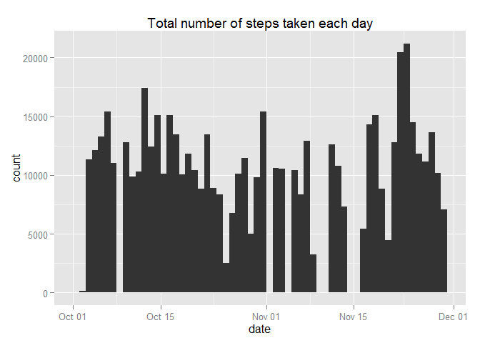
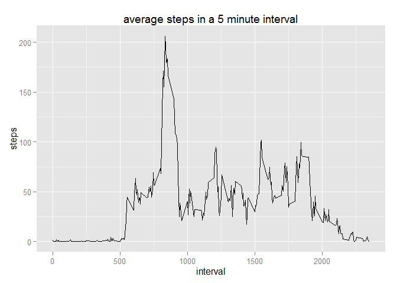
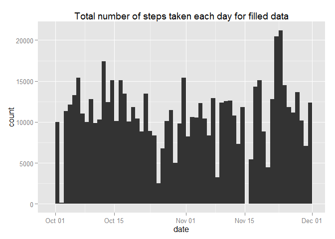
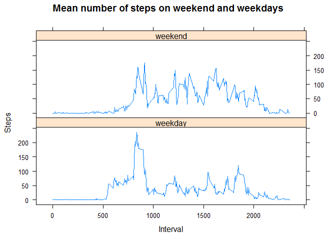

# Reproducible Research: Peer Assessment 1
Antti Savolainen  


## Loading and preprocessing the data
We begin with loading the data. This will get the data from the internet if it doesn't exist in the current working directory

```r
if (file.exists("activity.csv")) {
  data <- read.csv("activity.csv")
} else {

	if(!file.exists("activity.zip")) {
	print("missing data file, downloading it")
	zipfile <- tempfile()
	download.file("https://d396qusza40orc.cloudfront.net/repdata%2Fdata%2Factivity.zip",
                zipfile)
	data <- read.csv(unz(zipfile, "activity.csv"))
	unlink(zipfile)
	rm(zipfile)
	} else {
		data <- read.csv(unz("activity.zip", "activity.csv"))
	}
} 
```
To make our life a bit easier later on we make sure the classes are correct for the columns

```r
data$steps <- as.numeric(data$steps)
data$date <- as.Date(data$date)
data$interval <- as.numeric(as.character(data$interval))
```


## Data with missing values
When we check the data we immediately notice that there are a lot of step values that are missing. Actually there are


```r
sum(is.na(data))
```

```
## [1] 2304
```

values missing.

To start with we explore the daily patterns a bit when omitting the times when the number of steps is missing. We get the following plot of the histogram of the total number of steps taken each day:


```r
naOmit <- na.omit(data)
library(ggplot2)
qplot(date, data = naOmit, weight = steps, geom = "histogram", binwidth = 1, 
      main = "Total number of steps taken each day")
```

 

The mean and median total number of steps taken each day are


```r
totalSteps <- aggregate(naOmit$steps, list(Date = naOmit$date), FUN = "sum")
mean(totalSteps$x)
```

```
## [1] 10766.19
```


```r
median(totalSteps$x)
```

```
## [1] 10765
```

## What is the average daily activity pattern?

The average daily activity pattern with 5 minute intervals is:

```r
meanSteps <- aggregate(naOmit$steps, 
                       list(interval = as.numeric(as.character(naOmit$interval)))
                       , FUN = "mean")
qplot(x=interval, y=x, data = meanSteps, geom = "line", ylab = "steps",
      main = "average steps in a 5 minute interval")
```

 

With the highest activity being at 

```r
meanSteps$interval[which.max(meanSteps$x)]
```

```
## [1] 835
```
meaning that on average the peak activity is at 8:35.

## Imputing missing values

Since omitting the missing values completely can result in skewed data I devised a strategy of filling the missing value based on the mean value at that time of the day for that weekday. This can be accomplished with:


```r
naOmit$weekday <- weekdays(naOmit$date)
unique(naOmit$weekday) # make sure we have data for all weekdays
```

```
## [1] "Tuesday"   "Wednesday" "Thursday"  "Friday"    "Saturday"  "Sunday"   
## [7] "Monday"
```

```r
meanStepWeekdays <- aggregate(naOmit$steps, 
                              list(interval = as.numeric(as.character(naOmit$interval)),
                                   weekday = naOmit$weekday), FUN = "mean")

filledData <- data

for(i in 1:nrow(data))
{
  if(is.na(data$steps[i]))
	{
		# tempWeekday <- weekdays(data$date[i])
		# tempInterval <- data$interval[i]
		filledData$steps[i] <- 
      meanStepWeekdays[meanStepWeekdays$interval ==  data$interval[i] & 
                         meanStepWeekdays$weekday == weekdays(data$date[i]), ]$x
	}
}
```


```r
qplot(date, data = filledData, weight = steps, geom = "histogram", 
      binwidth = 1, main = "Total number of steps taken each day for filled data")
```

 

```r
filledTotalSteps <- aggregate(filledData$steps, list(Date = filledData$date), FUN = "sum")
mean(filledTotalSteps$x)
```

```
## [1] 10821.21
```

```r
median(filledTotalSteps$x)
```

```
## [1] 11015
```

This slightly increases the mean (increase of 55.02) and median (increase of 250) total number of daily steps.

## Are there differences in activity patterns between weekdays and weekends?

The reason for the increase can be that there is a difference in the activity pattern for weekdays and weekends. 


```r
filledData$weekday <- factor(weekdays(filledData$date))
levels(filledData$weekday) <- list(weekday = c("Monday", "Tuesday", "Wednesday",
                                               "Thursday", "Friday"),
                                   weekend = c("Saturday", "Sunday"))
meanStep <- aggregate(filledData$steps, 
                      list(interval = as.numeric(as.character(filledData$interval)),
                           weekday = filledData$weekday), FUN = "mean")

library(lattice)
xyplot(meanStep$x ~ meanStep$interval | meanStep$weekday, layout = c(1,2), type = "l", 
       xlab = "Interval", ylab = "Steps", 
       main = "Mean number of steps on weekend and weekdays")
```

 

Based on the time series plots there is a clear difference between weekdays and weekend.


